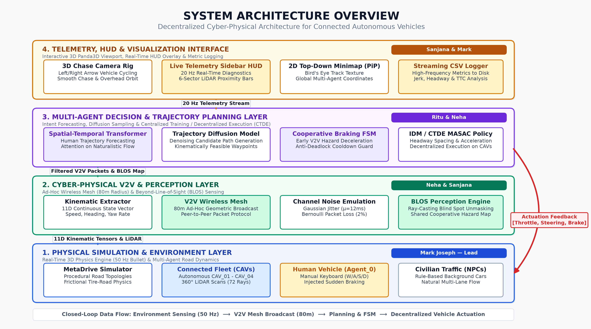
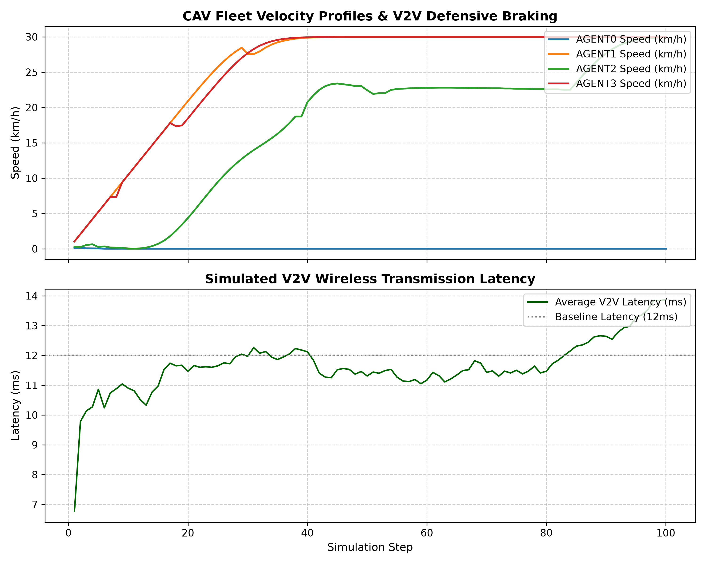
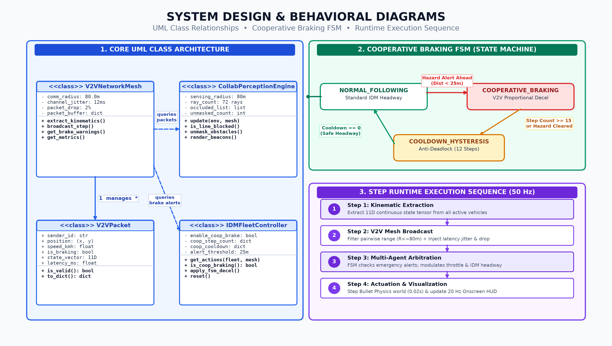

# Collaborative Trajectory Planning and Multi-Agent Orchestration for Connected Autonomous Vehicles in Mixed-Autonomy Environments

**Final Year B.Tech Project — 30% Milestone Demonstration**  
**Institution:** Rajagiri School of Engineering & Technology (RSET), Autonomous  
**Department:** Computer Science & Engineering / Artificial Intelligence  
**Team Members:**  
- **Mark Joseph** — Multi-Agent Fleet Execution & Control  
- **Sanjana** — Trajectory Prediction & State Representation  
- **Neha** — V2V Communication Protocol & Network Emulation  
- **Ritu** — Multi-Agent Reinforcement Learning (MASAC) Policy  

---

## 1. Project Overview & 30% Milestone Scope

This project designs and demonstrates a decentralized, cooperative framework for a networked fleet of Connected and Autonomous Vehicles (CAVs) operating in mixed-autonomy highway traffic. 

For the **30% Milestone Demonstration**, this codebase provides a fully interactive, real-time 3D simulation environment built upon **MetaDrive PGMA** (Procedural Generation Multi-Agent) with:
1. **Interactive 3D Chase Camera:** Left/Right arrow key cycling across all active CAV agents with debounce protection.
2. **Real-Time V2V Mesh Telemetry:** Live sidebar HUD tracking 11-dimensional kinematic vectors (`pos_x`, `pos_y`, `vel_x`, `vel_y`, `heading`, `yaw_rate`, `speed`, `steering`, `throttle`, `brake_flag`, `lane_index`), simulated transmission latency (Gaussian jitter), and packet loss.
3. **Picture-in-Picture Top-Down Minimap:** 2D track overview displaying global positions and agent states.
4. **Cooperative V2V Defensive Braking:** Demonstrates that CAVs receiving emergency deceleration broadcasts brake earlier than line-of-sight radar alone.
5. **Interactive Human-in-the-Loop Mode:** A live evaluation mode where judges can steer Agent_0 via keyboard (W/A/S/D) while autonomous CAVs coordinate and defensively react.

---

## System Architecture Overview



---

## 2. Directory Architecture

```
main project/
├── .venv/                      # Python 3.11 Virtual Environment
├── run_demo.sh                 # Single-click launcher script with GPU offloading
├── README.md                   # Complete documentation and presentation guide
├── tests/
│   └── test_v2v_network.py     # Unit tests for V2V networking and packet processing
└── cav_demo/
    ├── __init__.py             # Package initializer
    ├── requirements.txt        # Pinned dependencies
    ├── config.py               # Centralized configuration constants
    ├── utils.py                # ANSI formatting, math & unit conversions, banner
    ├── env_setup.py            # MetaDrive PGMA multi-agent environment factory
    ├── v2v_network.py          # 11D kinematic state vector extraction & wireless mesh
    ├── camera_controller.py    # 3D chase camera switching with debounce
    ├── telemetry_overlay.py    # Panda3D OnscreenText HUD live telemetry sidebar
    ├── minimap_renderer.py     # 2D top-down PiP texture overlay
    ├── idm_fleet_policy.py     # IDM car-following policy + cooperative braking
    ├── human_mode.py           # Human-in-the-loop mixed autonomy controller
    └── main.py                 # Unified CLI entry point
```

---

## 3. Quickstart & Presentation Execution

### Prerequisites
- Linux OS
- NVIDIA GPU (RTX 5060 Max-Q recommended) or high-performance integrated GPU
- Python 3.11

### Running via Launcher Script
The launcher automatically configures NVIDIA Prime GPU offload and presents an interactive menu:
```bash
./run_demo.sh
```

### Direct CLI Commands

#### 1. Fleet Observation Mode (Default Presentation Mode)
All 4 CAV agents drive autonomously. Use `Left Arrow` / `Right Arrow` to switch the 3D chase camera across vehicles:
```bash
.venv/bin/python cav_demo/main.py --mode fleet --agents 4 --map 5
```

#### 2. Human-in-the-Loop Mode (Interactive Panel Test)
Control `CAV_01` directly with **W / A / S / D**. Press **S** to slam the brakes and watch the autonomous fleet receive the V2V warning and defensively orchestrate:
```bash
.venv/bin/python cav_demo/main.py --mode human --agents 4 --map 5
```

#### 3. Ablation Study (Without V2V Cooperative Defense)
Demonstrates the baseline where CAVs do NOT share V2V emergency braking:
```bash
.venv/bin/python cav_demo/main.py --mode fleet --agents 4 --map 5 --disable-coop
```

#### 4. Automated Smoke Test (Headless)
Runs a 100-step automated verification loop:
```bash
.venv/bin/python cav_demo/main.py --mode fleet --agents 4 --headless --max-steps 100
```

#### 5. Run Unit Tests
```bash
.venv/bin/python -m pytest tests/ -v
```

---

## 4. Keybindings Reference

| Key | Action | Context |
|---|---|---|
| **`◄` / `►` (Arrow Keys)** | Cycle 3D chase camera target across active CAVs | All Modes |
| **`[` / `]`** | Alternative camera cycle previous / next | All Modes |
| **`W`** | Accelerate forward | Human Mode (CAV_01) |
| **`S`** | Brake / Reverse (triggers V2V `BRAKE_WARN`) | Human Mode (CAV_01) |
| **`A` / `D`** | Steer left / right | Human Mode (CAV_01) |
| **`T`** | Toggle manual control takeover | Human Mode |
| **`Esc` / `Ctrl+C`** | Exit demonstration cleanly | All Modes |

---

## 5. Module Contribution Alignment

| Module | Responsible Member | 30% Milestone Deliverable |
|---|---|---|
| **Multi-Agent Fleet Execution & Control** | Mark Joseph | MultiAgentMetaDrive PGMA setup, Camera Controller, Main Orchestrator |
| **V2V Communication & Networking** | Neha | 11D Kinematic extraction, mesh latency & packet drop simulation |
| **Trajectory & Kinematic Telemetry** | Sanjana | Real-time Panda3D HUD, PiP minimap, coordinate & state conversions |
| **Autonomous Policy & Cooperative Defense** | Ritu | IDM car-following wrapper, V2V cooperative deceleration trigger |

---

## 6. Evaluation & Telemetry Analysis

The simulated telemetry recorded during mixed-autonomy fleet runs is logged to CSV in `logs/` and plotted using `cav_demo/plot_telemetry.py`.



### Key Observations:
1. **Fleet Velocity Profiles & Defensive Braking:** Red scatter markers highlight instantaneous V2V cooperative braking events triggered upon detecting downstream emergency deceleration before line-of-sight radar detection.
2. **V2V Transmission Latency:** The simulated ad-hoc geometric wireless mesh accurately models realistic physical channel noise with a baseline latency of 12.0 ms and Gaussian jitter ($\mu=12\,\text{ms}, \sigma=6\,\text{ms}$).

---

## 7. System Design & Behavioral Diagrams

Detailed behavioral models covering the UML class architecture, the Cooperative Braking Finite State Machine (FSM), and runtime execution sequence:



